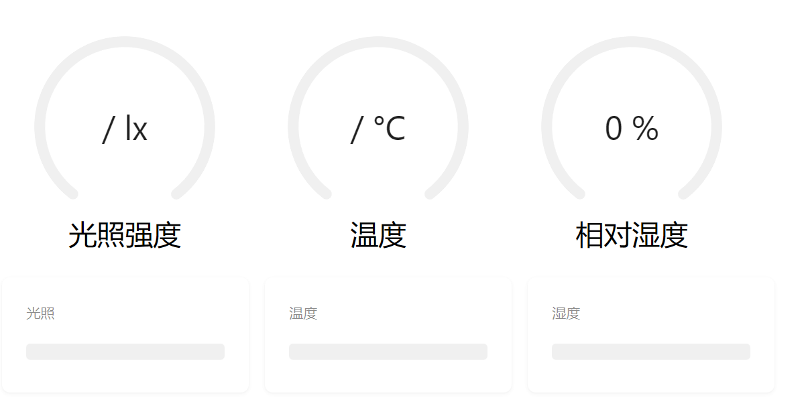

# 数据展示流
## esp8266获取数据流程

1. 连接wifi 打印ip地址
2. 挂载http-get服务器
3. 循环接收数据，从cc2530串口读取到?就存在一个string类型的变量data里
4. 循环赋值获取上一次和上上一次的数据，即为data data_last data_past 

```c
 string1_past = string1_last;
      string1_last = string1;
      string1 = char_sum;
```

---

<br/>
## 前端处理

1. 设置路由路径/getdata,网页轮询http://ip:80/getdata GET方法得到，网页端进行数据处理
并设置跨域"Access-Control-Allow-Origin", "*"

2.前端技术栈
+ 语言：HTML5+CSS3+less+Typescript+Javascript
+ 框架：React+Vite
+ 依赖 Axios
+ 组件库：Antd

页面设置了两个哈希路由，首页展示光照，温度，湿度
通过Axios循环发包请求8266获取data+data_last+data_past
分割处理数据，最后展示到原子组件上


# 数据控制流

## 首先从浏览器上点击按钮，向

`http://ip:80/switch?a=1&b=${whichSwitch}`

8266收到后转发给串口，编码方式是收到0-8的数字就反转使能

## 内网穿透
通过cpolar内网穿透，可以实现在世界上任何一个有网络的地方控制和接收来自家里的数据，这就是目前最主流的物联网前端解决方案